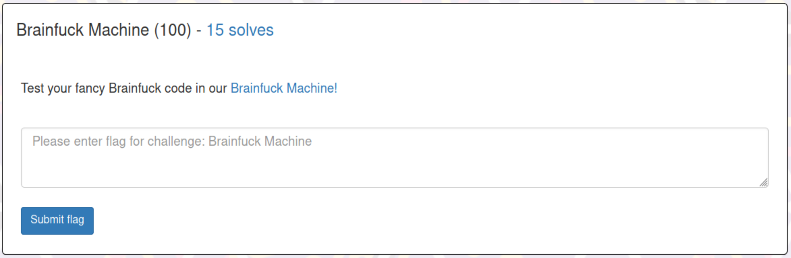
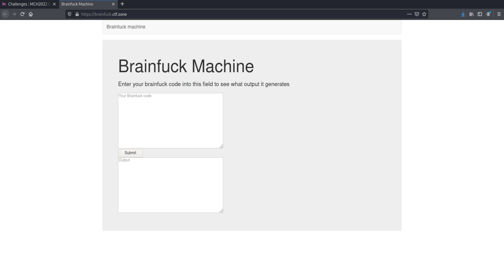
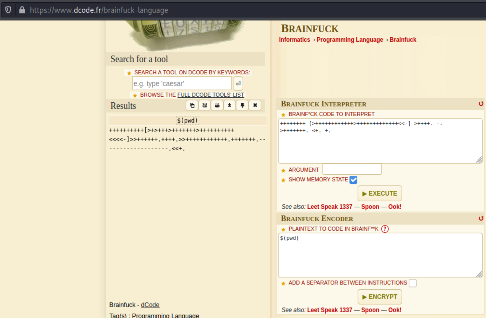
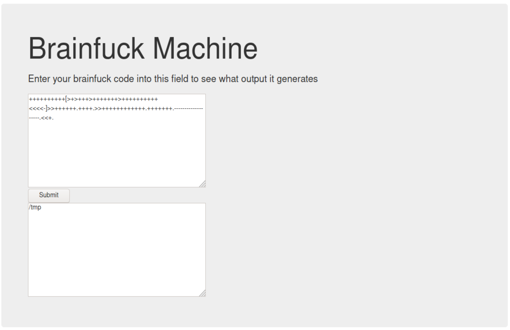
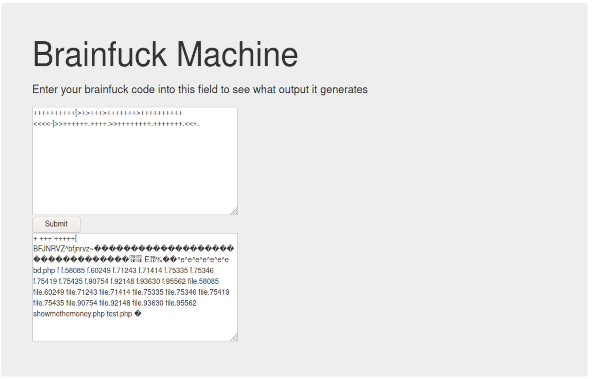
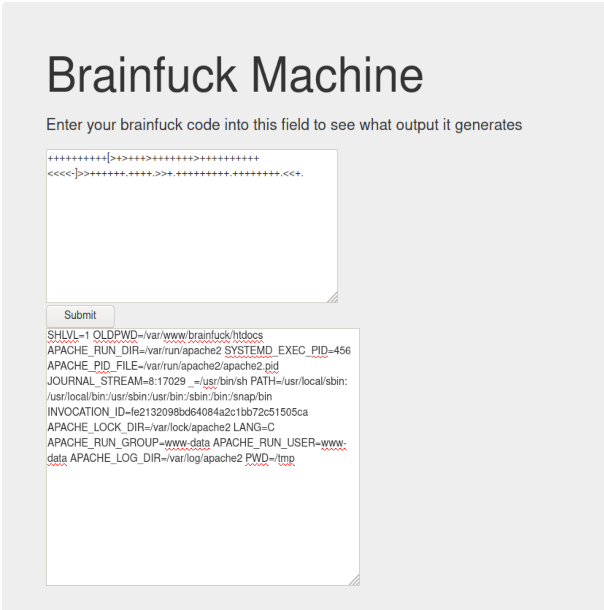
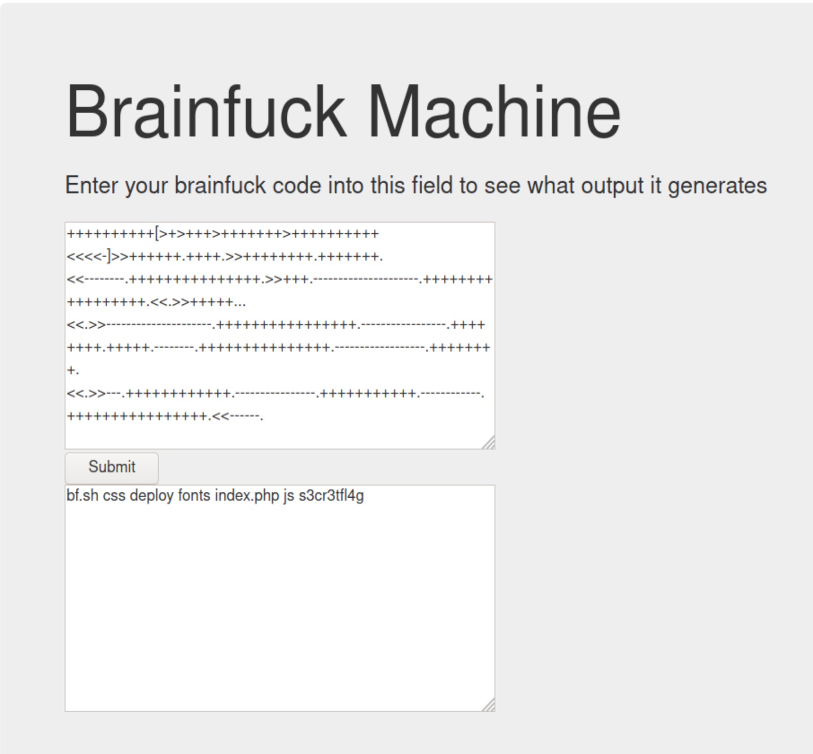
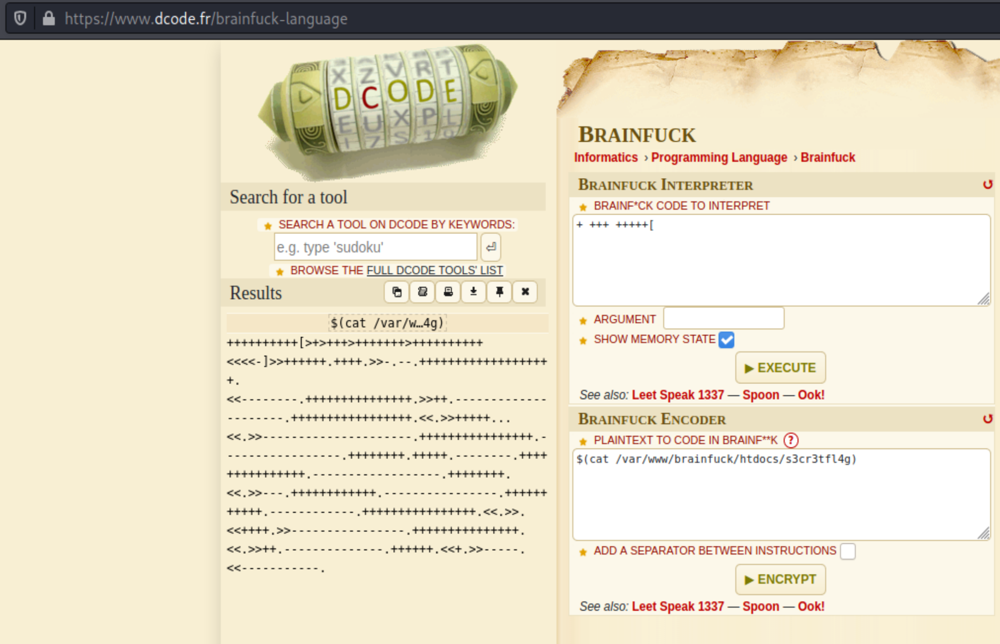
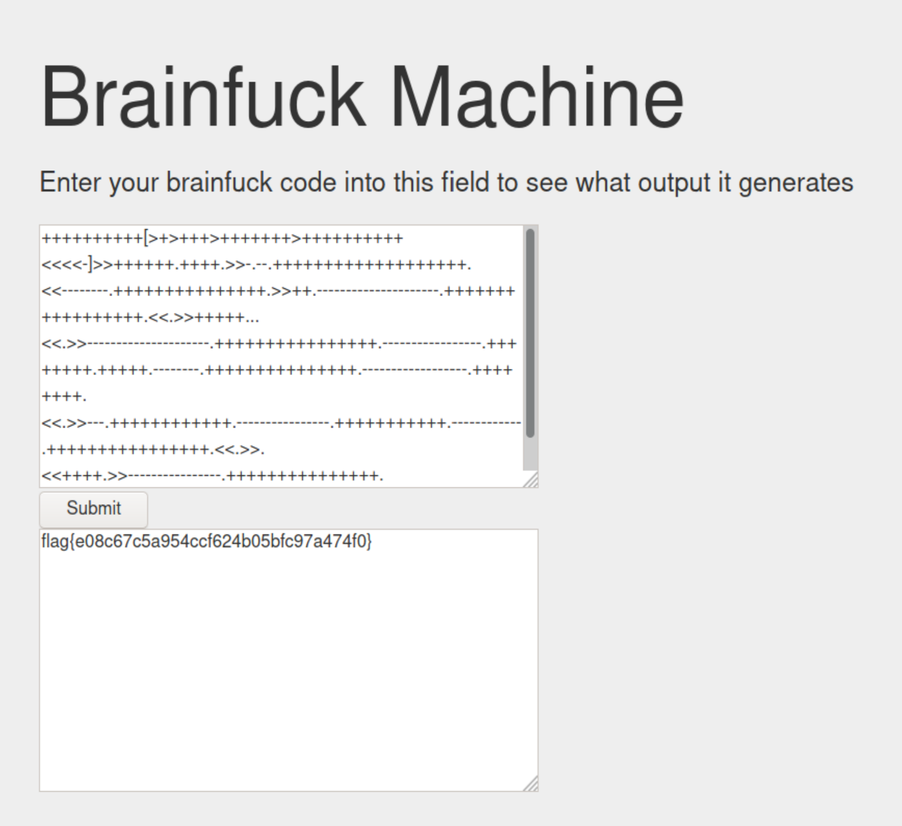

# Brainfuck Machine (Web Challenge)

## The Challenge

Clicking on the 'Brainfuck Machine' link takes you to the following website, where you can submit Brainfuck code and get clear text output.

## Testing

Since it was a web challenge, I poked around in the inspector - checking the html, cookies, network traffic, etc. There didn't seem to be anything of note there, so I started to play around with different inputs.

The first attempt, @TClasen suggested we input 'echo $shell' [in brainfuck]. The only clear text returned was 'echo', meaning the dollar sign evaluated (and everything following it). We moved forward with testing different Linux commands.

In a previous challenge we found the flag in the Present Working Directory (pwd), so we checked there first. There was no flag, but it did confirm our theory that we could input Linux commands. We attempted $(ls) next.

There were a few interesting things here, but no flag. We catted 'showmethemoney.php', which was blank. We moved on for the moment but came back to this later when we got stuck. 'test.php' was also empty. If you catted the files (f.####), they revealed what some of the other teams were inputting. It gave us a few ideas to test, but ultimately we wound up returning to our second test: $(env)

At first, we didn't notice anything particularly interesting. We tried several other commands after this, including a search for any files containing 'flag*' (which only resulted in system files), and anything containing 'flag{' (which timed out/never yielded results). When these other commands didn't work, we returned to the ls results and borrowed some ideas from other teams (such as navigating to root). Right as we were calling it quits on this challenge, @TClasen decided to test out $(env) again and poke around the "Old Present Working Directory" link (OLDPWD) noted at the top. Success.

## Flag Discovery

When we entered the input '$(ls /var/www/brainfuck/htdocs), we were rewarded with the following:

----
From there, it was just a matter of catting the file 's3cr3tfl4g' (secretflag). So a quick encoding of our message...

----
...and we had our flag!

