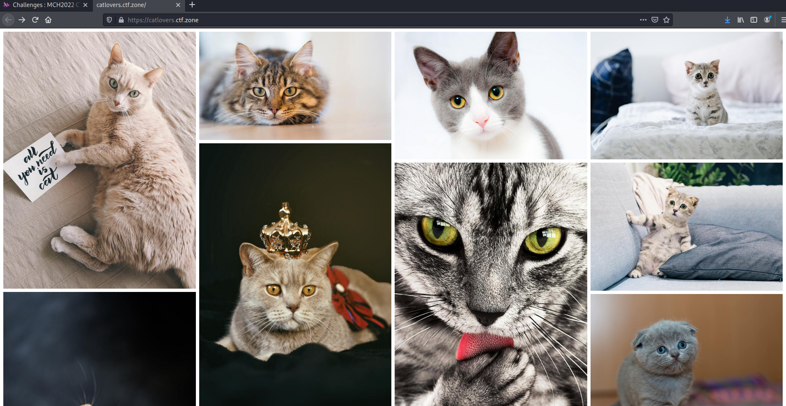
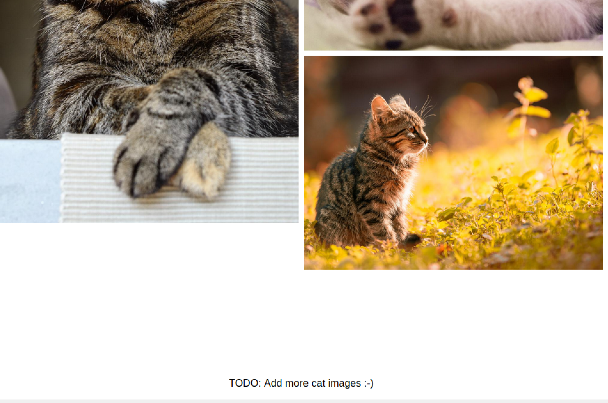
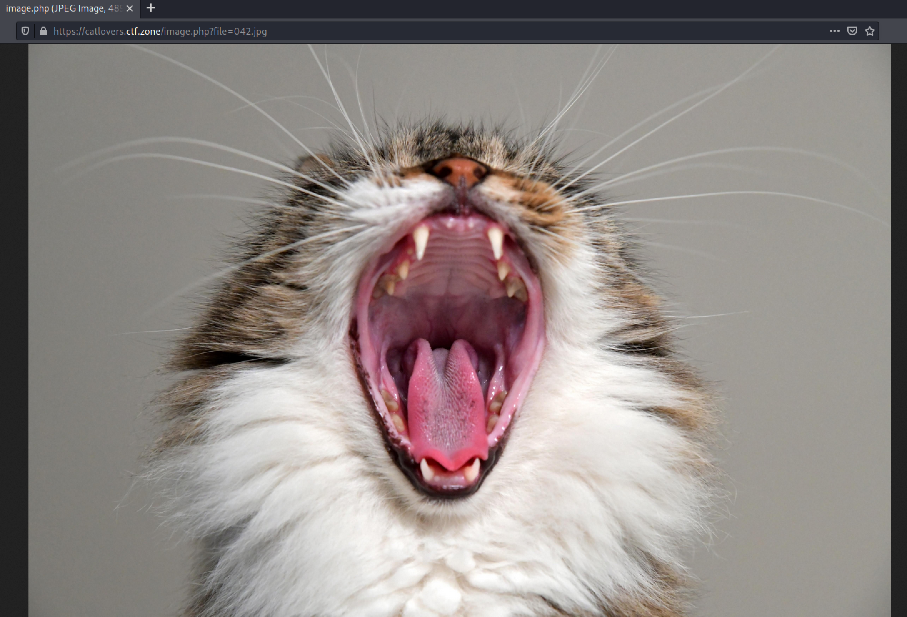
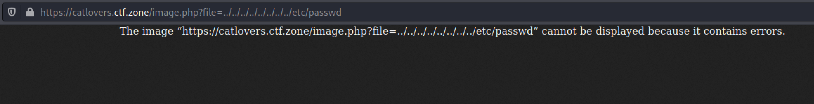
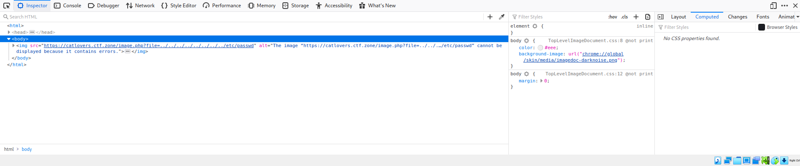
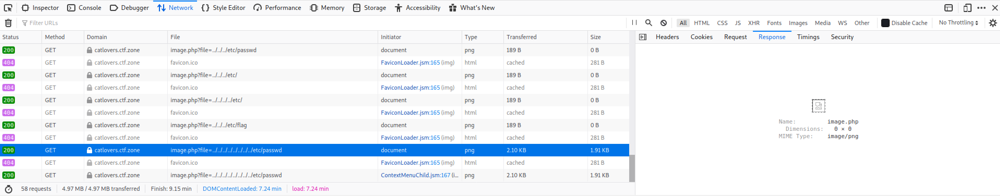
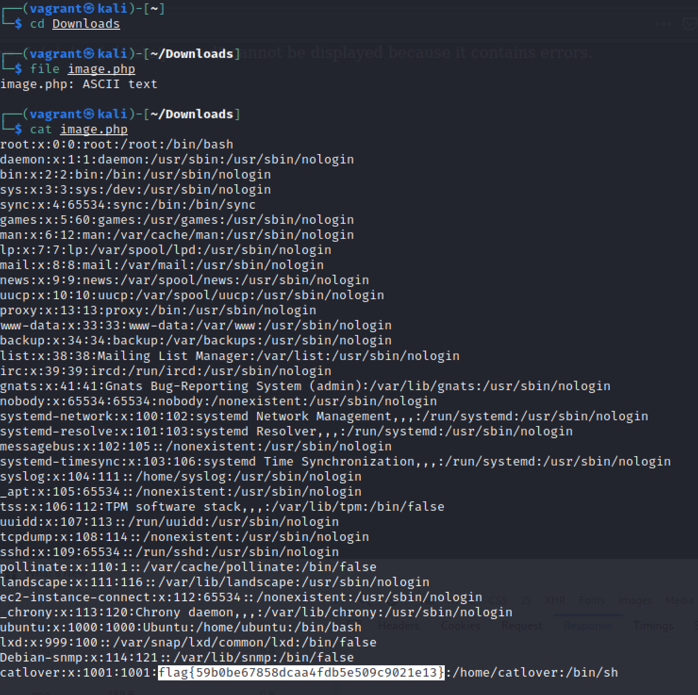

# Cats (Web Challenge)

## The Challenge
Cats challenge provided web link which led us to:

----
Scrolling to the bottom revealed instructions to add even more cat photos:

## Attempting to Add Images
I modified the html in the inspector to duplicate one of the div elements, then modified the img src elements to increase the count of each photo. Sure enough, there were more photos to be added. Images 041 and 042.

## Directory Transversal
I incorrectly attempted a transversal. Teammate @TClasen corrected me and we wound up with this error message.

----
I noticed in the inspector that the error message was actually showing up as an image, rather than generated text. @TClasen suggested we examine the network traffic for the error and we discovered the broken image.

## Examining the Error Message
We downloaded the image and ran the File command on it, revealing that it was ASCII text. We catted the image, which revealed a Linux passwd file that contained 

