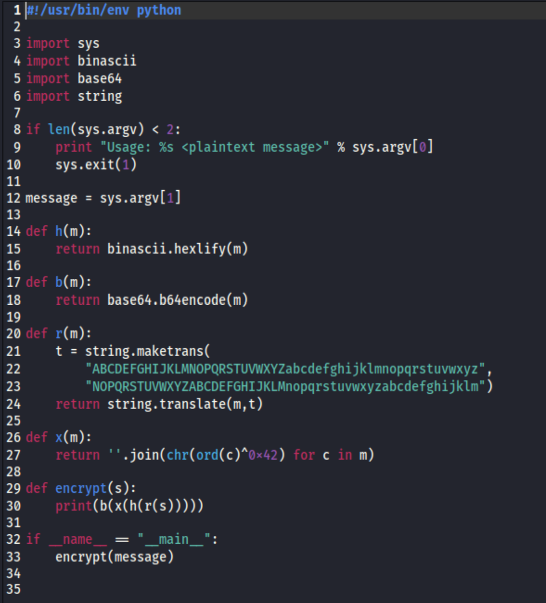
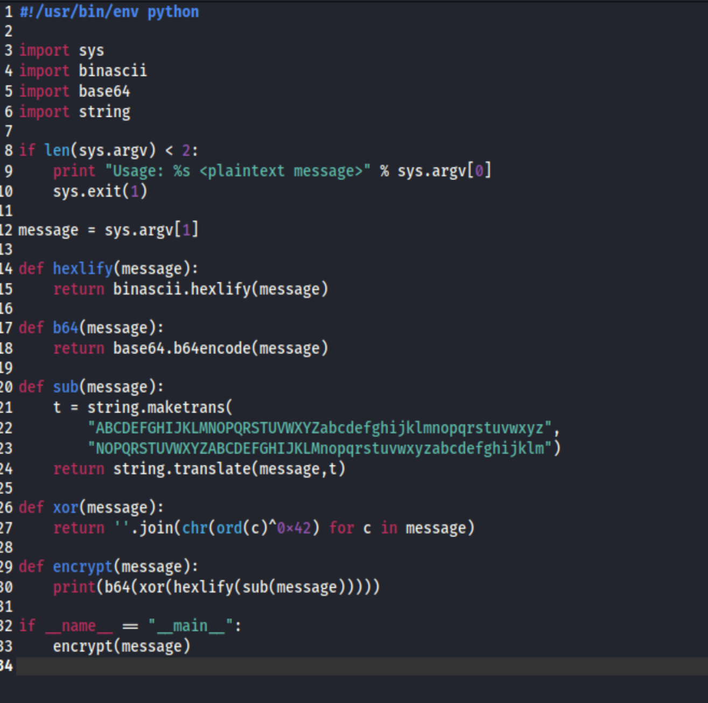
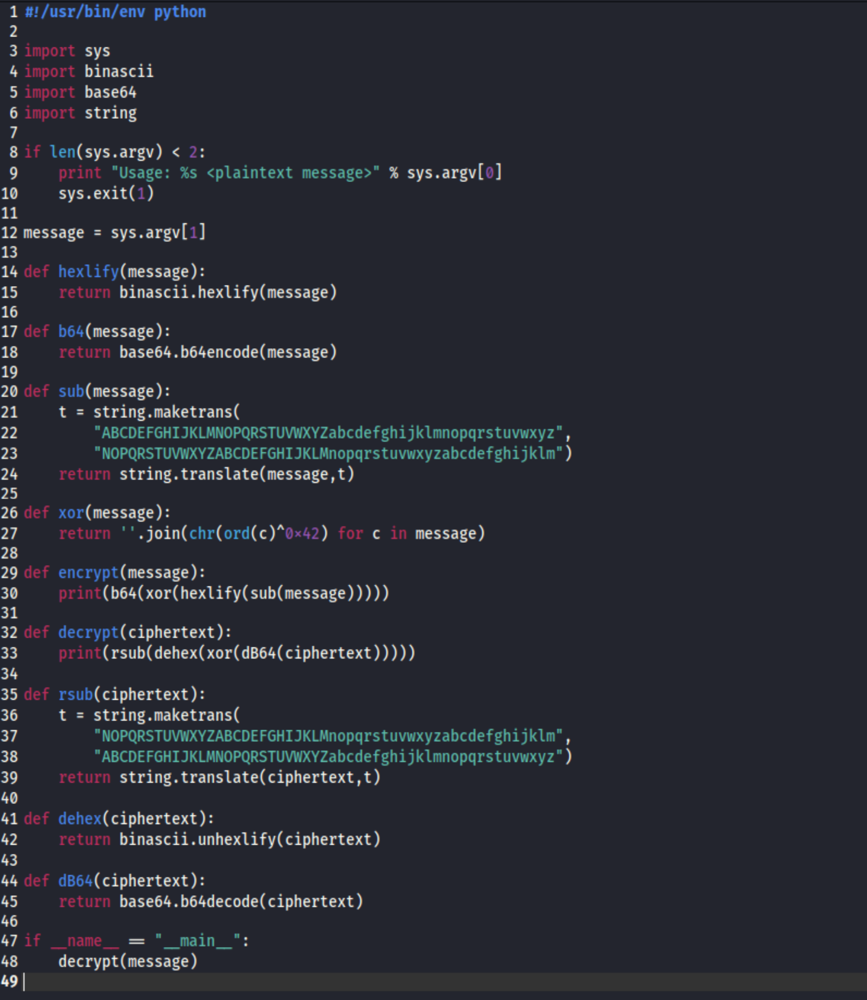
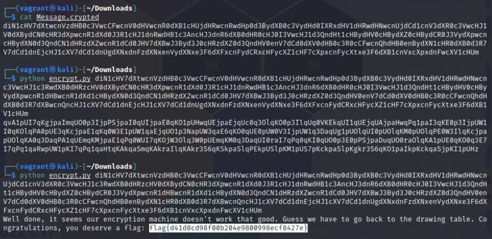

# Crypto Machine 01 (Crypto Challenge)
## The Challenge
"We just started to learn programming and builded our first crypto machine. Can you decrypt this message?" A file was also available for download: a tgz. The first step was to unzip the tarball (tgz file), which provided us with two files: encrypt.py and Message.crypted (a text file).

## The Encryption

The python file was pretty straight forward, but @TClasen suggested the first step was to make it a bit more readable. This made things much easier as we moved forward. Reading from the bottom up, we changed variable 's' to 'message' on lines 29 and 30; as well as each instance of variable 'm'. We then renamed each function to identify its particular task. The result is as follows.

I chose "sub" to indicate a substitution cipher (aka translation cipher).

## Decryption

The next step was to reverse all of the steps of the encryption (in reverse order) so that we could run it against the ciphertext. (Since the xor function used a hardcoded value, all we had to do was run the same funcion again.) 

*for my own understanding, I used "ciphertext" in place of "message" as a variable name. This tripped us up on the xor function. I'd recommend just using the same variable name consistently throughout in future applications. n00b mistakes.

## Code Execution

I copied the ciphertext from Message.crypted and passed it into our function (we called the decrypt function we wrote in the encrypt.py), revealing the clear text and the flag.

Note: The first execution you see resulted in more ciphertext, which pointed to a problem in our code. It was the fact that I'd failed to change "message" to "ciphertext" in the xor function.