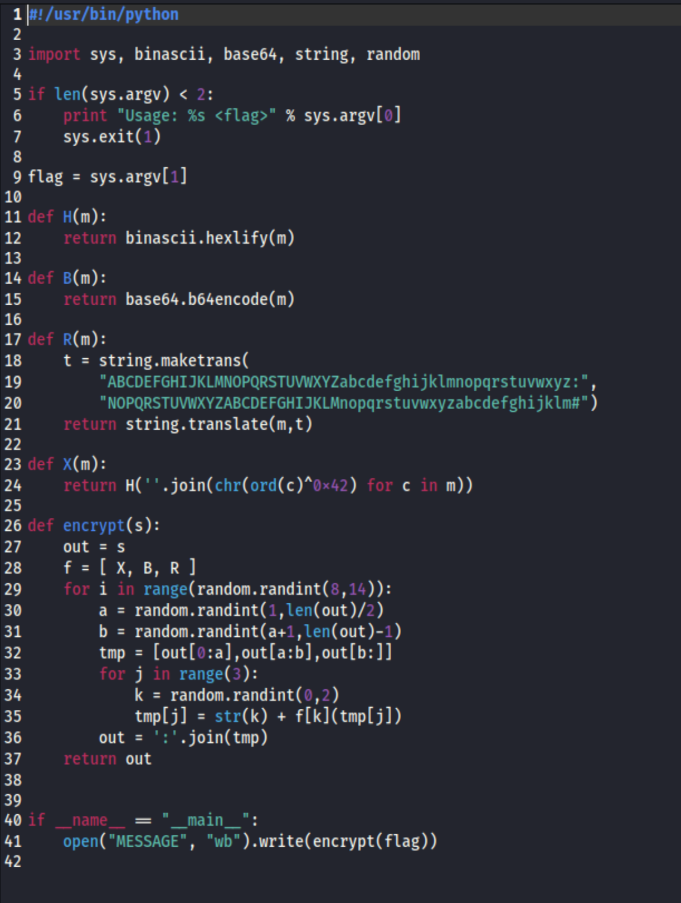
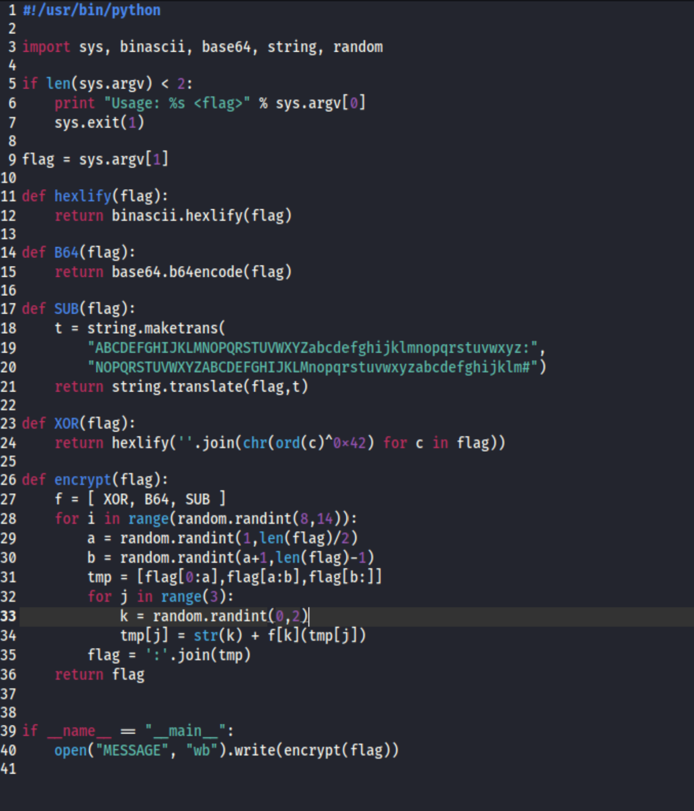
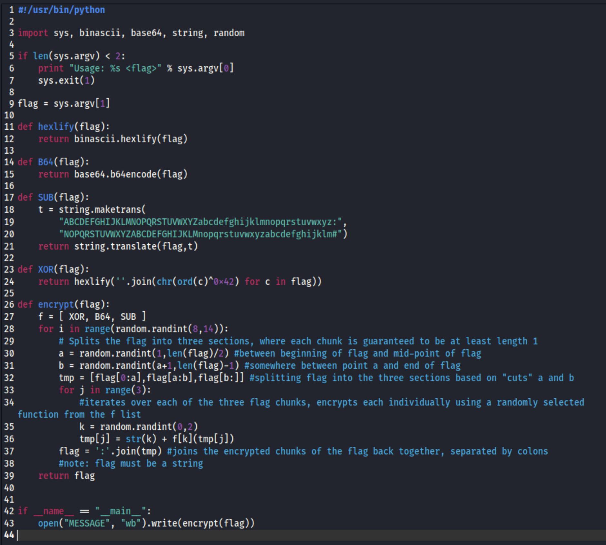
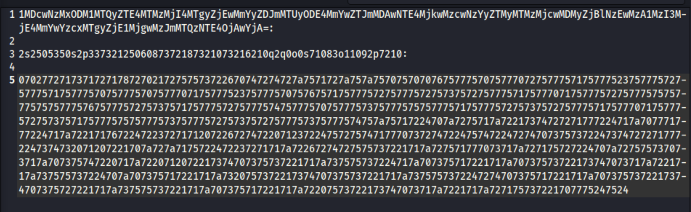
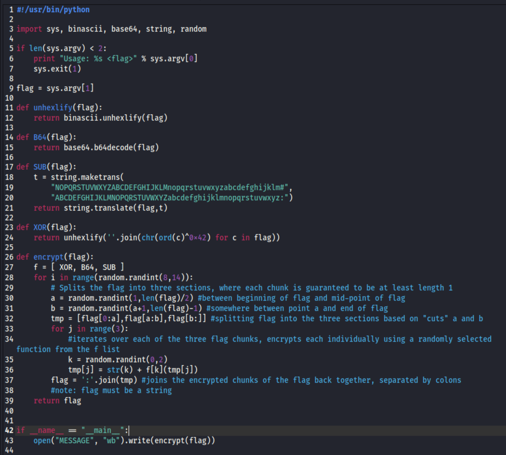
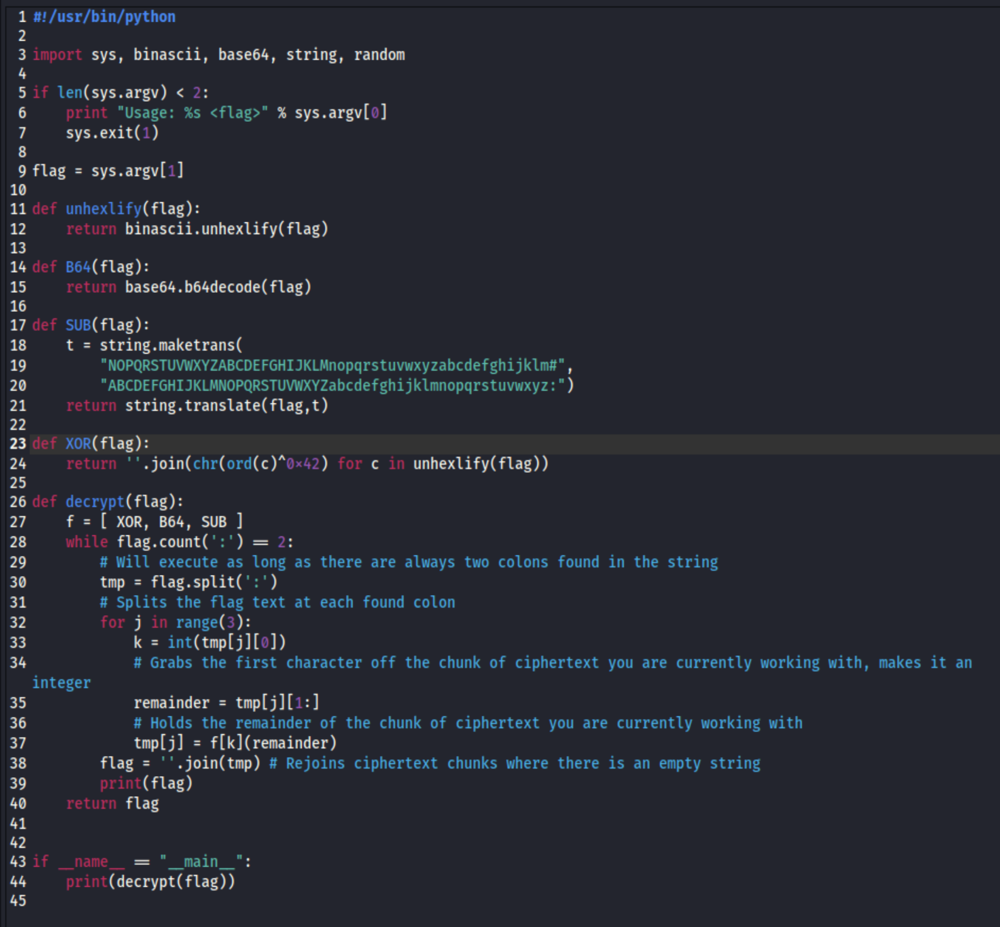
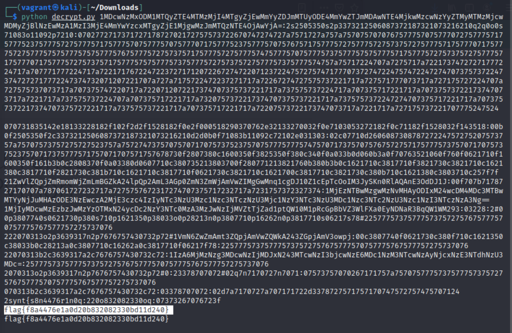

# Crypto Machine 2 (Crypto Challenge)

# The Challenge
"We went back to the drawing table and we think we improved our script. Can you still decrypt the message?"
Just as the previous challenge, a tgz file is attached for download.

Unzipping the tarball (tgz file), you are given two files: encrypt.py and MESSAGE (a text file).

# The Encryption

The first step was to simplify the code, once again. I started with what I knew: changing the m and s variables to match the output variable and modifying the function names to match their purpose.

The encrypt function itself was a bit more complicated, so @TClasen walked me through what was happening so I could understand how to reverse it. We wound up removing the 'out' variable within the encrypt function altogether as well, since it just renamed an existing variable.

We then took a look at the ciphertext. @TClasen pointed out that I could find the two colons that divided it into three chunks. Each of these chunks begins with a number (0, 1, 2) which would correspond to the f list of encryption functions (denoted as variable k). 

If we could remove that initial number from the chunk and decrypt the remainder of the chunk using the specified encoding algorithm, the output would provide us with the next iteration of ciphertext with the same pattern of an initial number followed by a chunk of ciphertext.

# Decryption

We started by reversing the functions for the encoding algorithms. The encrypt function itself took some more effort.

The 'for' loop we changed to a 'while' loop, looking for two colons within the ciphertext to hopefully stop the function once it was complete. Then we proceeded with dividing the chunks of ciphertext between the k value and the remaining ciphertext for each chunk, decoding the chunks, and untimately regoining the clear text.

# Code Execution

Voila!

