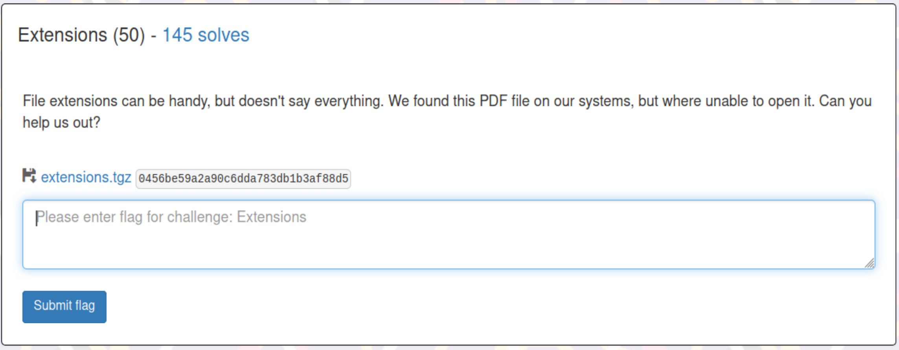

# Extensions (Forensics Challenge)

## The Challenge

So you're given a tgz file to unzip that we can assume contains a PDF that won't open. Given the title of the challenge and context clues, we can reasonably assume that the PDF is not, in fact, a PDF. Let's find out what it is.

## Extension Exploration

Unzipping the .tgz, we're given 'flag.pdf'. However, we are assuming it's not a PDF... so we run Linux command 'file' against it and discover that it's a .zip. Easy! We simply unzip the "PDF" and are rewarded with 'flag.jpg'.

...but why won't it open?

# Not So Easy...

Fool me once, shame on me... 

Flag.jpg turned out to be a zip, as well. So when it contained "flag.png", I ran 'file' on it. Sure enough, things were not as they seemed: a POSIX tar archive (essentially, another zip).

flag.pdf  > flag.jpg 

flag.jpg  > flag.png

flag.png  > flag.docx

flag.docx > flag.tmp

flag.tmp  > flag

And finally... 'flag' was actually a .jpg

# The Flag

