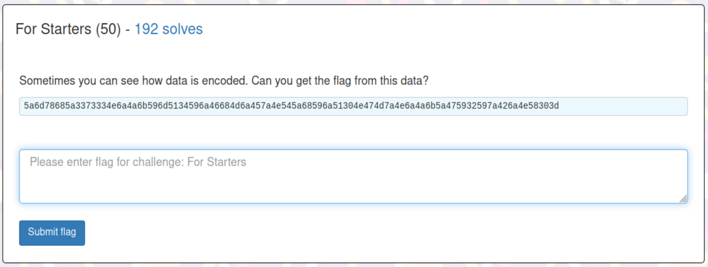
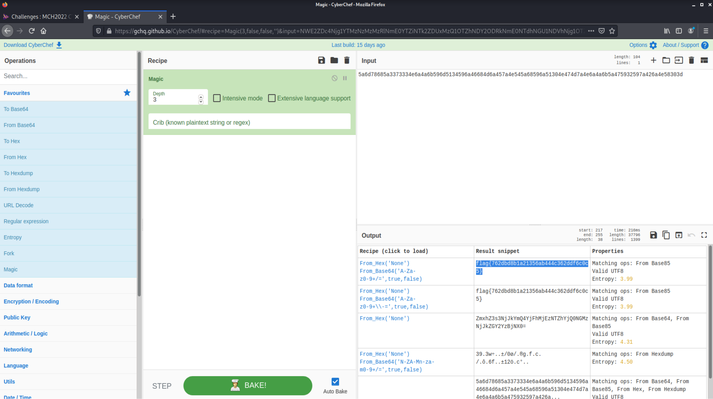

# For Starters (Misc Challenge)

## The Challenge

We're given a random string of gibberish... what could it be?! This looks like a job for Cyber Chef!

## Cyber Chef Magic

To my untrained eye, I thought it looked like Base64. I was wrong. @TClasen suggested Base32. This didn't work either. We tried hex next, and @TClasen recognized the output of the hex decoding as Base64. So we added the Base64 decryption to the pot and sure enough! Flag.

We'd had some issues with the 'Magic' function not being as magic as we expected during CTF meetings.. so we tried it on this as a test. Success!

