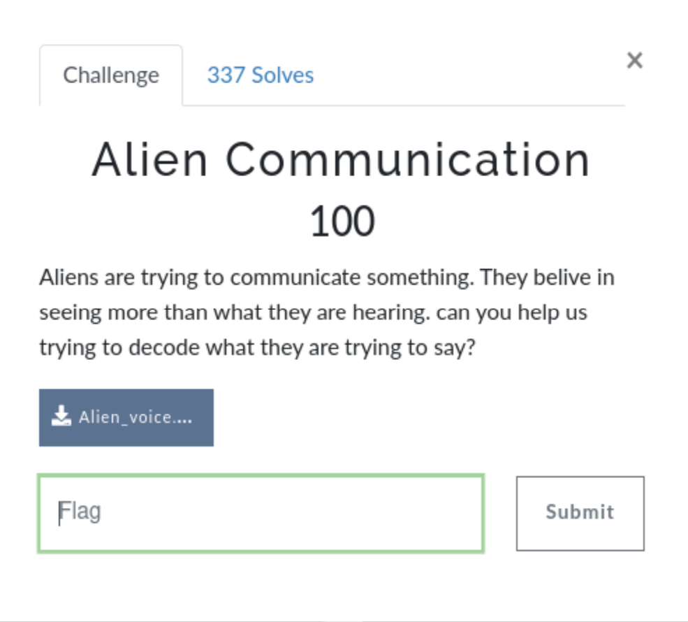
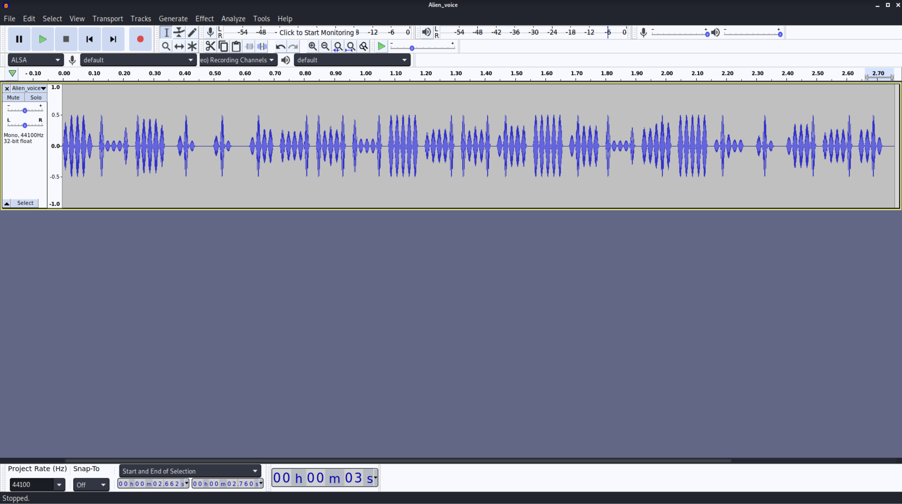
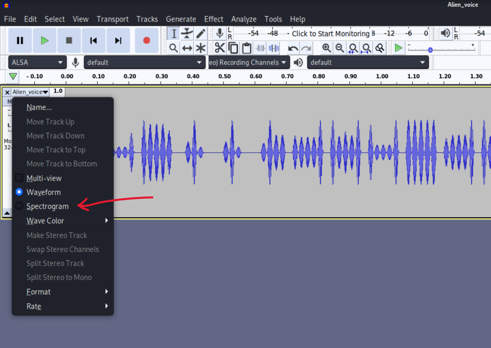
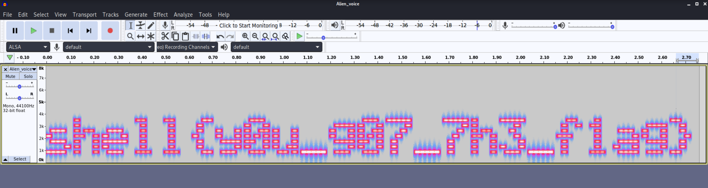

# Alien Communication (Forensics)

## The Challenge

We are given a .wav file to download. Given that this is a challenge in the Forensics category, I assume we're going to be looking for something hidden within the file itself rather than trying to decode some alien language.

## Examining the File

I opened the file in Audacity and play it, but nothing really stands out. My first guess anytime I'm given a CTF challenge with an audio file is to examine the spectrogram.

## The Flag

The first guess was correct! The flag was hidden in the spectrogram.

