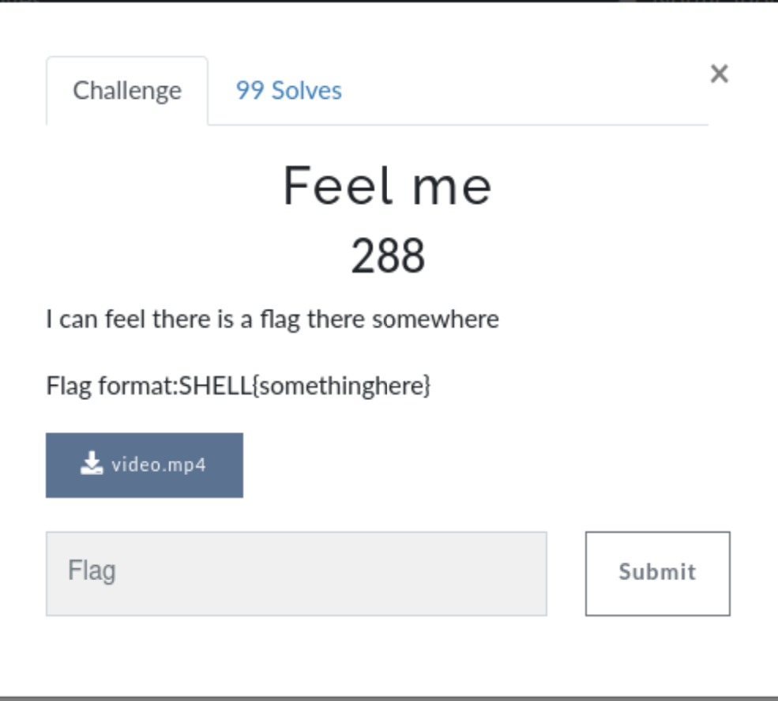
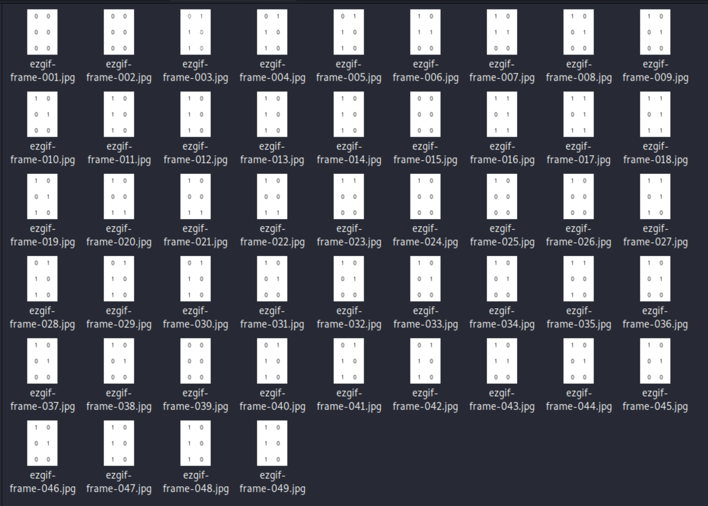
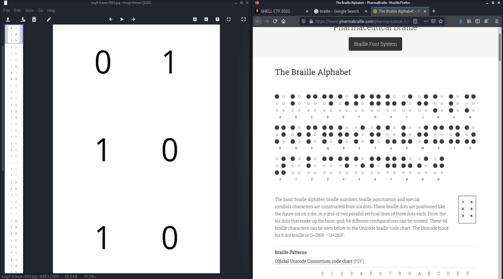

# Feel Me (Crypto)

## The Challenge

The Challenge has you download a .mp4 video that is 2.4 seconds of six rapidly cycling 0's and 1's.

## Looking for Clues

Seeing 0's and 1's usually indicates binary. However, each frame only contains six bits. Perhaps it would make more sense once we could see *all* off the images side by side. So, I passed it through an online video-to-images tool.

There were several duplicates and no clear pattern. It became clear that it was not binary because I could not easily break these images down into anything divisible by 8. Returning to the challenge, I wondered if it could be braille.

## The Flag

Sure enough! A braille cell is a stack of six dots, three high and two wide - just like in the video. So with the help of Google... I was able to piece together the flag: youcanseeme