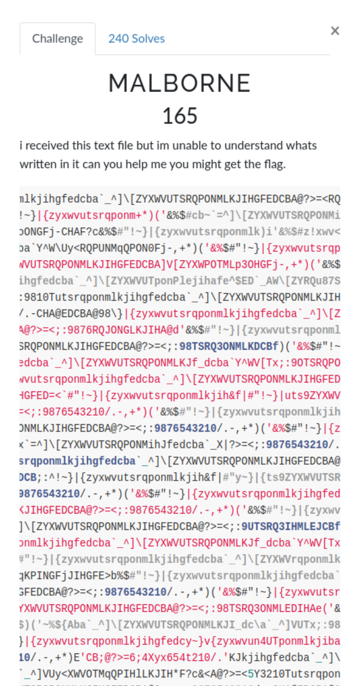
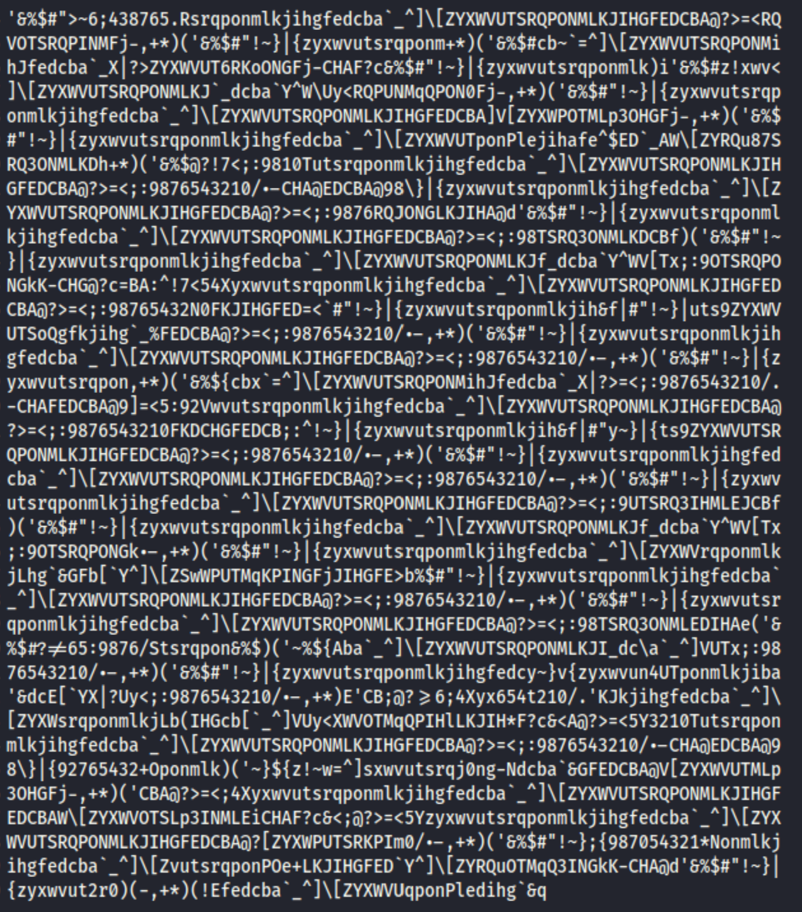
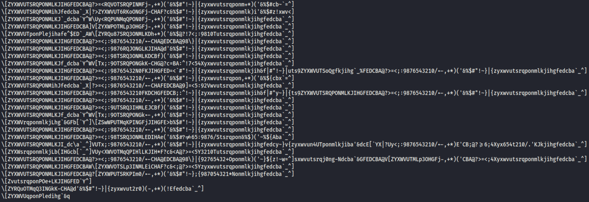
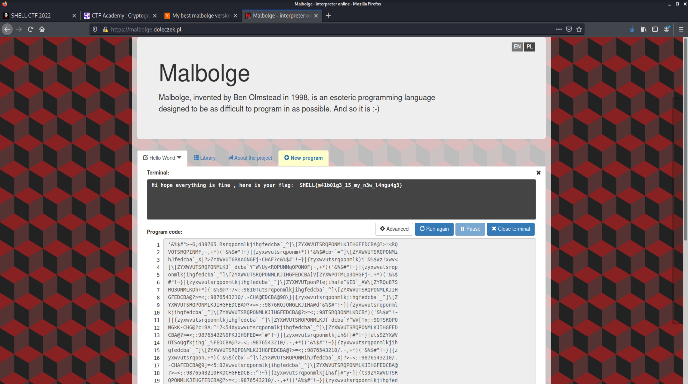

# Malborne (Crypto)

## The Challenge

The challenge gives you a window full of random alphanumeric and special characters that it asks you to decipher.

## Organizing the Data

The name of this challenge seemed like a clue, but it wasn't one I was familiar with. So, I began by copying the pile of characters to a text editor and looking for patterns.

One thing that stood out was the pattern of ]/[ and there had been another challenge I'd worked on where parts of the message were divided by a / so I separated these out.

I Googled a couple of lines of the code and found nothing. I set the challenge aside to work on others for a while. When I came back to it, I Googled a smaller section of code, which resulted in a link to: https://new.ycombinator.com/item?id=4922282

## The Flag

Once I was aware of Malbolge, all I had to do was find an online interpreter and copy/paste.

