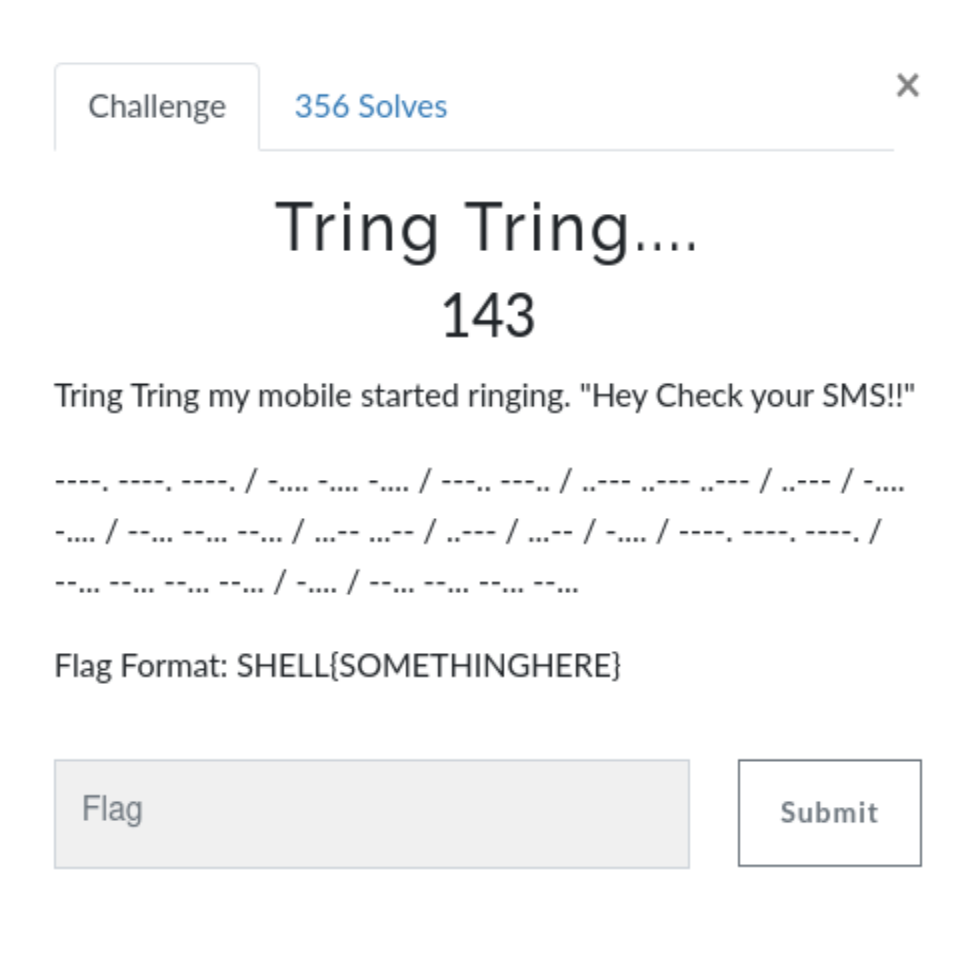
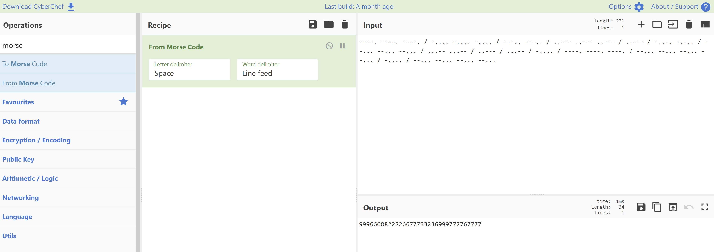

# Tring Tring... (Crypto)

## The Challenge

You start of with a strip of dots and dashes separated by forward slashes. Any time I see dots and dashes, I assume Morse Code. However, it struck me as odd that each section was the same character repeated a number of times.

Text version of the code, in case you want to copy/paste yourself. -->

----. ----. ----. / -.... -.... -.... / ---.. ---.. / ..--- ..--- ..--- / ..--- / -.... -.... / --... --... --... / ...-- ...-- / ..--- / ...-- / -.... / ----. ----. ----. / --... --... --... --... / -.... / --... --... --... --...

## Deciphering the Message

First I tested my Morse Code theory using CyberChef.

Sure enough, we would up with a series of numbers. That, combined with the mobile phone reference, led me to believe we had a phone keypad / T9 cipher on our hands.

## The Flag

You could use a decoding tool like https://www.dcode.fr/phone-keypad-cipher However, I just looked at my phone and translated the flag: youcanseemysms