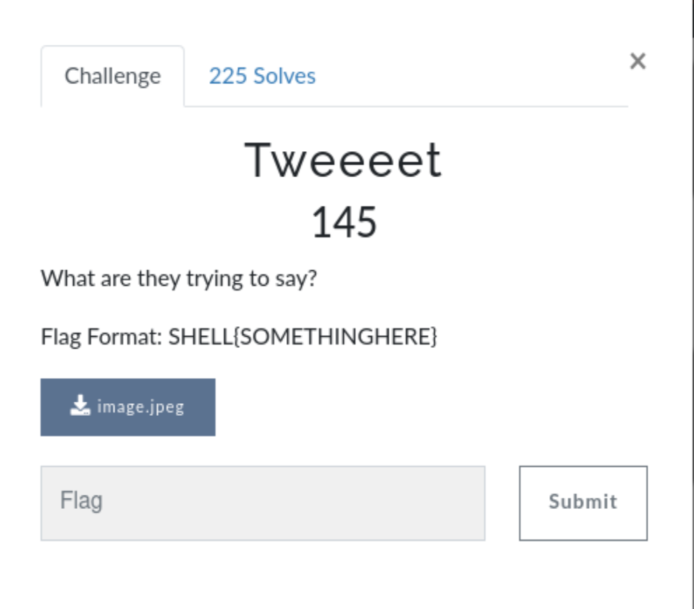
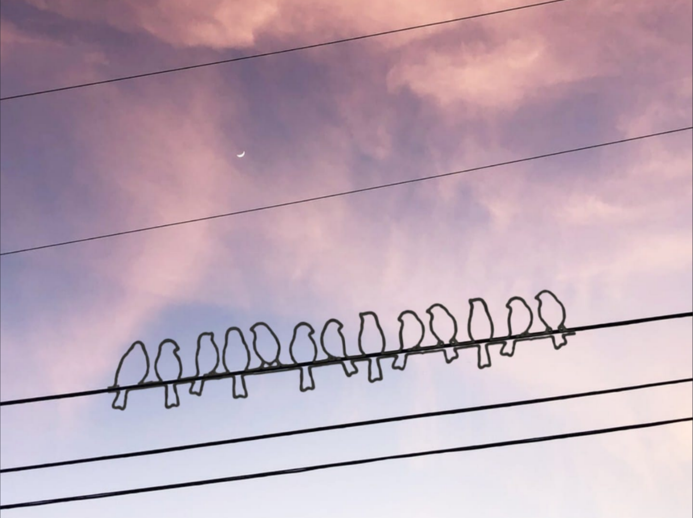
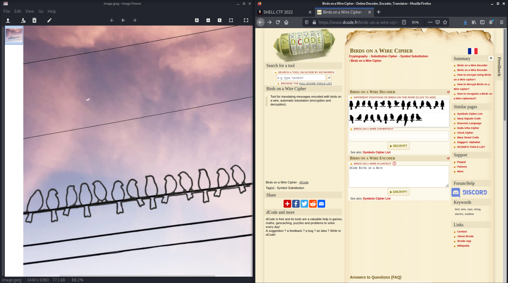

# Tweeeet (Crypto)

## The Challenge

You are given an image to download, containing a sunset sky with a crescent moon in the distant background and thirteen molded-wire bird shapes on a wire.

## Birds on a Wire

This one stumped me at first because I kept trying to make it a forensics challenge - looking at exif data and such things. However, this was a *crypto* challenge and the birds were clearly the focal point.

Eventually I wound up googling "birds on a wire cipher" and learned something new. 

## The Flag

Once I had a decoding tool, it just required putting in the right input. The birds were saying: WELOVESINGING